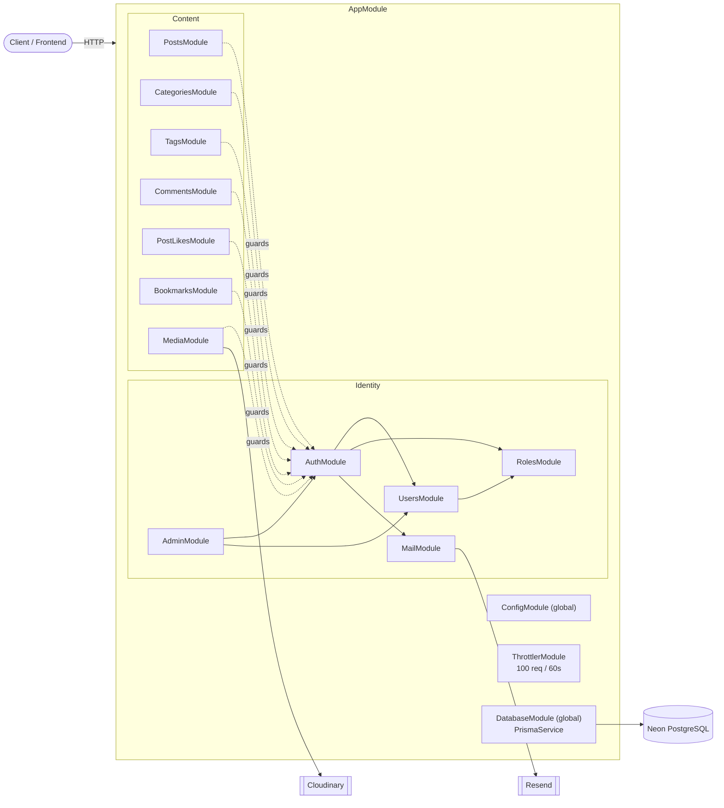
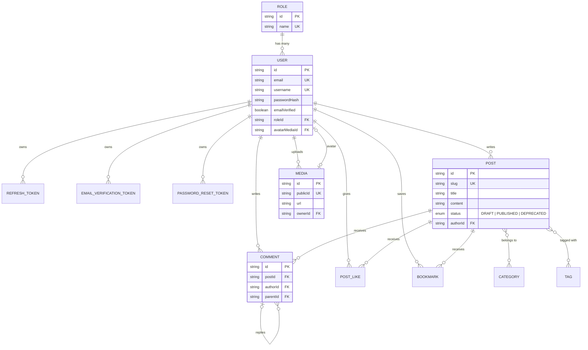
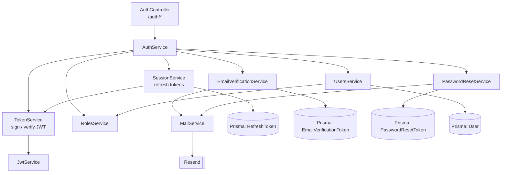
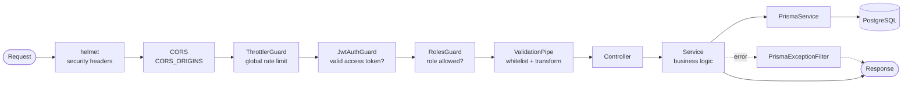

# Kia Blog Backend — Architecture

A visual map of the backend. All diagrams are [Mermaid](https://mermaid.js.org/) and render directly on GitHub.

**Stack:** NestJS · Prisma · PostgreSQL (Neon) · Cloudinary (media) · Resend (email) · Vercel (deploy)

---

## 1. Big picture: modules and external services

Every feature is its own NestJS module. Feature modules import `AuthModule` only to reuse the guards (`JwtAuthGuard`, `RolesGuard`). `DatabaseModule` is `@Global()`, so `PrismaService` is injectable everywhere without being imported.



Solid arrows = real business dependency. Dotted arrows = "imports AuthModule just for the guards".

---

## 2. Database model



Notes:
- `POST_LIKE` and `BOOKMARK` have a composite unique on `(userId, postId)`, so a user can like or bookmark a post only once.
- Deleting a `USER` cascades to their posts, comments, tokens, likes, bookmarks and media. Deleting a `COMMENT` cascades to its replies.
- Token tables store a **hash** of the token, never the raw value.

---

## 3. Inside the auth system

`AuthService` is the orchestrator. The real work is split into small single-purpose services.



---

## 4. Life of a request



`JwtAuthGuard` and `RolesGuard` only run on routes that declare them with `@UseGuards(...)`. Public routes skip straight from the throttler to validation.

---

## 5. Endpoint map by access level

| Area | Public | Logged in | AUTHOR / ADMIN | ADMIN only |
|---|---|---|---|---|
| **Auth** `/auth` | register, login, refresh, logout, verify-email, forgot-password, reset-password | me, logout-all | | |
| **Posts** `/posts` | list, get by slug | | create, mine, mine/:id, update, delete | by-id/:id |
| **Categories** `/categories` | list | | | create, update, delete |
| **Tags** `/tags` | list | | | create, update, delete |
| **Comments** | list on post | create, reply, edit, delete | | |
| **Likes** | count on post | like, unlike | | |
| **Bookmarks** | | bookmark, unbookmark, list mine | | |
| **Media** `/media` | | upload image, delete, set avatar | | |
| **Admin** `/admin` | | | | list users, get user, change role |
| **App** | `/`, `/health` | | | |

Roles: `USER`, `AUTHOR`, `ADMIN`.

---

## 6. Folder layout

```mermaid
flowchart LR
backend/
├── prisma/                 schema + migrations
├── src/
│   ├── main.ts             bootstrap: helmet, Swagger, CORS, ValidationPipe, filter
│   ├── app.module.ts       root module, global throttler guard
│   ├── database/           PrismaService (global)
│   ├── common/filters/     PrismaExceptionFilter
│   ├── auth/               controller, service, guards, decorators, token/session/email services
│   ├── users/ roles/ admin/ mail/
│   ├── posts/ categories/ tags/ comments/ post-likes/ bookmarks/ media/
│   └── generated/prisma/   auto-generated client (do not edit)
└── test/                   e2e tests (Vitest + Supertest)
```

Each feature folder follows the same pattern: `*.module.ts` → `*.controller.ts` → `*.service.ts`, plus `dto/` for input validation and `*.spec.ts` for unit tests.
